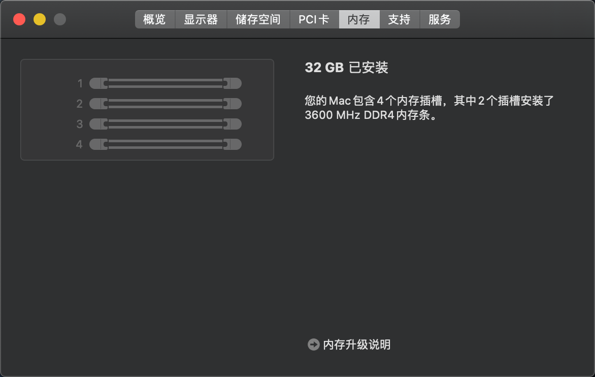
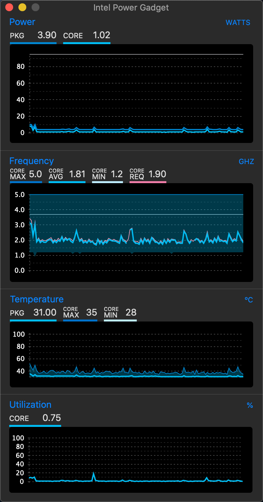

# 介绍

长期不定期维护，我的工作娱乐用黑苹果主机OpenCore引导配置指南

P.S. 本人非黑果大佬，闲暇之余慢慢摸索学习OC中，此EFI仅供满足本人日常使用，并非所有功能均完善，OC配置文件也非100%正确，套用之前请确保已阅读下列内容并正确完成相关设置，若有问题可提交至[Issues](https://github.com/leogcry22/iHac-Pro/issues)中

## 目录

- [预览](#预览)
- [硬件配置](#硬件配置)
- [组装建议](#组装建议)
- [SMBIOS](#SMBIOS)
- [开始之前](#开始之前)
- [BIOS设置](#BIOS设置)
- [注意事项](#注意事项)
- [USB定制](#USB定制)
- [正常工作](#正常工作)
- [不工作](#不工作)
- [历史更新记录](#历史更新记录)
- [参考](#参考)

## 预览

## 硬件配置

| 硬件 | 型号 | 说明 |
| :---: | --- | --- |
| 处理器 | 英特尔 酷睿 i5-9600KF | 稳定超频至5.0GHz |
| 主板 | 技嘉 Z390M Gaming |
| 内存 | 科赋 DDR4 2666MHz 16GB 普条 * 2| CJR颗粒，稳定超频至CL16 3600MHz |
| 显卡 | 蓝宝石 RX 5500 XT 白金版 OC |
| 固态硬盘1 | 西部数据 SN500 500GB| macOS工作用 |
| 固态硬盘2 | 西部数据 SN500 500GB| Windows娱乐用 |
| 机械硬盘 | 东芝 P300 3TB | Windows娱乐仓库盘，macOS使用NAS存储数据 |
| 散热器 | 九州风神 大霜塔 RGB |
| 机箱风扇 | 九州风神 魔环 RGB |
| 机箱 | 乔思伯 C3-PLUS |
| 电源 | 海盗船 RM650X |
| 显示器 | 戴尔 U2718Q 4K | 接DP口（3840x2160@60Hz），暂无任何问题 |
| 网卡&蓝牙 | 无 | 目前暂无需求，可自行加装白果网卡或兼容型号 |

## 组装建议

> - 处理器：理论上只要是9代无核显版本的任何型号CPU都支持，合理配置散热器即可
> - 显卡：目前已知RDNA架构全系列（如：5500XT/5600XT/5700XT）都支持，也可选择GCN架构的老卡
> - 主板：不保证这套EFI能套用至其它厂商的其它型号板子上，也许技嘉自家的系列可以
> - 固态硬盘：除了三星家的OEM盘PM981/PM981a有兼容问题之外，其余理论上均可
> - 仓库盘：以防万一，建议加装仓库盘用于Time Machine备份，我这里就用NAS了
> - 无线网卡：有需要的可以自行加装白果的免驱卡或者兼容的网卡进行配置
> - 显示器：4K及以上分辨率，PPI为160及以上的显示器观感最佳，显示接口建议使用Display Port可以避免一些问题
> - 其它硬件：选择自己中意的就行，不会有什么太大影响

## SMBIOS

  `iMacPro1,1`

  没什么可说的，目前只有使用这个SMBIOS在无核显的CPU上搭配独显才能正常硬件加速

## 开始之前

BIOS版本：[**`F9g`**](https://www.gigabyte.com/Motherboard/Z390-M-GAMING-rev-10/support#support-dl-bios)

**请务必确保BIOS中CFG Lock已解锁！！！**

**请务必确保BIOS中CFG Lock已解锁！！！**

**请务必确保BIOS中CFG Lock已解锁！！！**

解锁方式有多种，我采用是直接修改BIOS文件并刷入主板的方式，个人认为更简单且重置BIOS设置后不会失效，你也可以采用其它任何方式，如：[Fixing CFG Lock](https://khronokernel-2.gitbook.io/opencore-vanilla-desktop-guide/extras/msr-lock)

## BIOS设置

之前有更改过BIOS设置的，如果你自己都不清楚改过哪里了，建议先恢复一下出厂设置再继续

### 启用

- IO Ports - Above 4G Decoding - **Enabled**
- IO Ports - USB Configuration - XHCI Hand-off - **Enabled**
- Boot - Windows 8/10 Features - **Windows 8/10 WHQL**

### 禁用

- CFG Lock (MSR 0xE2 write protection) - **Disabled**（这块在UEFI BIOS中无法直接禁用）
- Tweaker - Advanced CPU Settings - VT-d - **Disabled**
- Settings - Miscellaneous - Software Guard Extensions(SGX) - **Disabled**
- Settings - Miscellaneous - Trusted Computing - Security Device Support - **Disabled**
- Boot - Fast Boot - **Disabled**
- Boot - CSM Support - **Disabled**
- Boot - Secure Boot - Secure Boot Enable - **Disabled**

## 注意事项

**安装之前请务必使用对应工具生成你自己的机器信息并填入[`EFI/OC/config.plist`](https://github.com/leogcry22/iHac-Pro/blob/master/EFI/OC/config.plist)中**

## USB定制

WIP

## 正常工作

* [x] 原生NVRAM
* [x] CPU变频
* [x] GPU硬件加速
* [x] 音频输入与输出
* [x] 睡眠与唤醒
* [x] 有线网络
* [x] USB
* [x] Time Machine

## 不工作

* [ ] 休眠
* [ ] 系统定位、随航、隔空投送、蓝牙、WIFI（需要无线网卡才能工作）
* [ ] FileVault
* [ ] 更多未知问题？请提交至[Issues](https://github.com/leogcry22/iHac-Pro/issues)中

## 历史更新记录

[查看](https://github.com/leogcry22/iHac-Pro/blob/master/RELEASENOTE.md)

## 参考

- [Opencore Configuration.pdf](https://github.com/acidanthera/OpenCorePkg/tree/master/Docs)

- [OpenCore Vanilla Guide](https://khronokernel-2.gitbook.io/opencore-vanilla-desktop-guide/)

- [使用OpenCore引导黑苹果](https://blog.xjn819.com/?p=543)

- [精解OpenCore](https://blog.daliansky.net/OpenCore-BootLoader.html)

- [技嘉神板回归！BIOS解锁CFG Lock！！！](https://bbs.pcbeta.org/viewthread-1835794-1-1.html)
